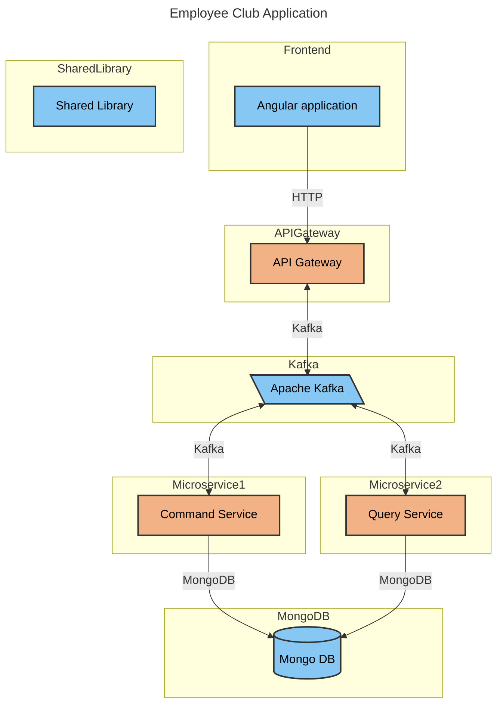

# EventsApplication

<a alt="Nx logo" href="https://nx.dev" target="_blank" rel="noreferrer"></a>

✨ **This workspace has been generated by [Nx, a Smart, fast and extensible build system.](https://nx.dev)** ✨

### Welcome to the Employees Club App! 

## App architecture

Even though we're barely scratching the surface of CQRS, we would like to slowly migrate towards a more CQRS-y architecture as we learn more about it and it makes sense. The CQRS module in NestJS does not play very well with a microservices-based architecture, so we decided to just go without it for now and simply do a split between our commands and queries services, so that we can scale them independently based on usage. In the future we might also be looking at ES (Event Sourcing) which is something that plays nice with CQRS. 





## Tech stack
The app uses an Angular frontend that communicates with a backend created using NestJS.
The backend app communicates with the outside world through the api-gateway service which, internally, communicates with the other microservices through Kafka messaging. App state is held in a Mongo database. 
The build process is handled by NX, a build system centered around the idea of a monorepo. Even though all code sits together, the services are packaged separately. They can be developed, tested, released and scaled separately.

## DED & starting things up

- make sure you have Docker installed
- NVM helps, app is created with Node 20.x so make sure you have those installed in order to develop locally
- pull the code from this repo
- `docker-compose up --build -V`
- you can open the app using an editor of your choice (I am using WebStorm)

## Testing things out

To test stuff is set up properly, send a POST request using whatever client you like:
```
--- POST a speaker
POST http://localhost:8080/api
Content-Type: application/json

{
  "email": "john@company.com",
  "firstName": "John",
  "lastName": "Doe",
  "joinedSystematic": "2020-03-01"
}
```
Then you can GET all saves speakers:
```
--- GET all speakers
GET http://localhost:8080/api
Content-Type: application/json
```


