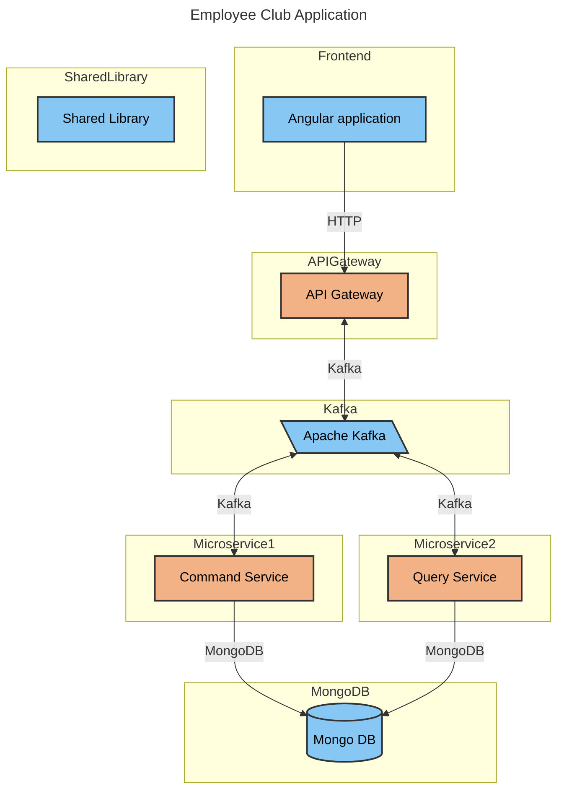

# EventsApplication

✨ **This workspace has been generated by [Nx, a Smart, fast and extensible build system.](https://nx.dev)** ✨

## App architecture

### Welcome to the Employees Club App! 

## DED & starting things up

- make sure you have Docker installed
- NVM helps, app is created with Node 20.x so make sure you have those installed in order to develop locally
- pull the code from this repo
- `docker-compose up --build -V`

## Generate code

