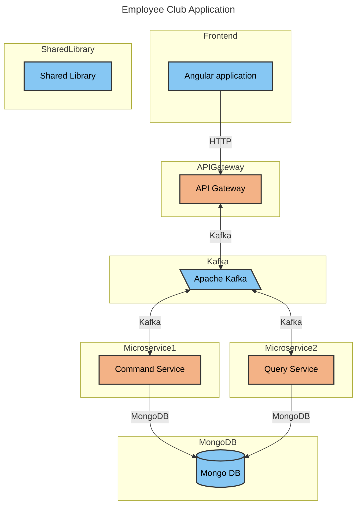

# Employee's Club Application

<a alt="Nx logo" href="https://nx.dev" target="_blank" rel="noreferrer"></a>

✨ **This workspace has been generated by [Nx, a Smart, fast and extensible build system.](https://nx.dev)** ✨

### Welcome to the Employees Club App! 

## App architecture

Even though we're barely scratching the surface of CQRS, we would like to slowly migrate towards a more CQRS-y architecture as we learn more about it and it makes sense. The CQRS module in NestJS does not seem to work very well with a microservices-based architecture, so we decided to just go without it for now and simply do a split between our commands and queries services, so that we can scale them independently based on usage. In the future we might also be looking at ES (Event Sourcing) which is something that plays nice with CQRS. 



```mermaid
---
title: Employee Club Application
---
graph TD;

  subgraph Frontend
    A[Angular application]
    style A fill:#86c7f3,stroke:#333,stroke-width:2px,color:#000;
  end

  subgraph APIGateway
    B[API Gateway]
    style B fill:#f3b286,stroke:#333,stroke-width:2px,color:#000;
  end

  subgraph Microservice1
    C[Command Service]
    style C fill:#f3b286,stroke:#333,stroke-width:2px,color:#000;
  end

  subgraph Microservice2
    D[Query Service]
    style D fill:#f3b286,stroke:#333,stroke-width:2px,color:#000;
  end

  subgraph Kafka
    E[\ Apache Kafka \]
    style E fill:#86c7f3,stroke:#333,stroke-width:2px,color:#000;
  end

  subgraph MongoDB
    F[(Mongo DB)]
    style F fill:#86c7f3,stroke:#333,stroke-width:2px,color:#000;
  end

  subgraph SharedLibrary
    G[Shared Library]
    style G fill:#86c7f3,stroke:#333,stroke-width:2px,color:#000;
  end

  A -->|HTTP| B
  B <-->|Kafka| E
  E <-->|Kafka| C
  E <-->|Kafka| D
  C -->|MongoDB| F
  D -->|MongoDB| F

```


## Tech stack
The app uses an Angular frontend that communicates with a backend created using NestJS.
The backend app communicates with the outside world through the api-gateway service which, internally, communicates with the other microservices through Kafka messaging. App state is held in a Mongo database. 
The build process is handled by NX, a build system centered around the idea of a monorepo. Even though all code sits together, the services are packaged separately. They can be developed, tested, released and scaled separately.

## Prerequisites

- **Node.js 20.x or higher** (required for local development)
  - Recommended: Use [NVM](https://nvm.sh) to manage Node.js versions
  - If using NVM: `nvm use` (reads from `.nvmrc` file)
- **Docker** (required for running the full application stack)

## Starting things up

- Make sure you have Docker installed
- Make sure you have Node.js 20.x or higher installed
  - If using NVM: run `nvm use` in the project root
- Pull the code from this repo
- Install dependencies: `npm install`
- Optional: Build all projects locally: `npx nx run-many -t build`
- Start the application: `docker-compose up --build -V`
- You can open the app using an editor of your choice (I am using WebStorm)

## Testing things out

- For a quick test of the local setup you can run `./test_setup.sh`
- To test stuff is set up properly, send a POST request using whatever client you like:
```
--- POST an event
POST http://localhost:8080/api
Content-Type: application/json

{
  "name": "X-mas party!",
  "eventType": "PARTY",
  "participants": [
    {
      "fullName": "Lynna Allman",
      "email": "lallman0@spotify.com",
      "title": "GIS Technical Architect",
      "initials": "lallman0"
    },
    {
      "fullName": "Darb Cronchey",
      "email": "dcronchey1@army.mil",
      "title": "Media Manager II",
      "initials": "dcronchey1"
    },
    {
      "fullName": "Aubert Ney",
      "email": "aney2@who.int",
      "title": "VP Sales",
      "initials": "aney2"
    }
  ]
}

```
Then you can GET all saved events:
```
--- GET all events
GET http://localhost:8080/api
Content-Type: application/json
```
Or, you could get a single event by id (replace id with an actual existing id):
```
--- GET by id
GET http://localhost:8080/api?id=658590fe4b292bff9e6a6541
Content-Type: application/json
```

Delete an event, specifying the Mongo _id as a path param:
```
--- DELETE an event

DELETE http://localhost:8080/api/6585d24552b29115b55979e8
```

Update an event:
```
PUT http://localhost:8080/api
Content-Type: application/json

{
  "_id": "6585d25d52b29115b55979eb",
  "name": "New Year's Party",
  "eventType": "PARTY",
  "participants": [
    {
      "fullName": "Lynna Clara Allman",
      "email": "lallman0@spotify.com",
      "title": "GIS Technical Architect",
      "initials": "lallman0"
    }
  ]
}
```

## Troubleshooting

### Build Fails with "SyntaxError: Unexpected token ?"

If you encounter an error like:
```
SyntaxError: Unexpected token ?
    at Module._compile (internal/modules/cjs/loader.js:723:23)
```

This means you're using an incompatible Node.js version. The application requires **Node.js 20.x or higher**.

**Solution:**
1. Check your Node.js version: `node --version`
2. If it's below 20.x, upgrade Node.js:
   - Using NVM (recommended): `nvm install 20 && nvm use 20`
   - Or download from [nodejs.org](https://nodejs.org/)
3. Clear npx cache if using npx: delete `~/.npm/_npx/` or run `npm cache clean --force`
4. Reinstall dependencies: `rm -rf node_modules package-lock.json && npm install`
5. Try again: `npx nx list`

### NX Affected Commands Fail

If `npx nx affected -t build` fails with git-related errors, use:
- `npx nx run-many -t build` - builds all projects
- `npx nx run-many -t test` - tests all projects
- `npx nx run-many -t lint` - lints all projects
